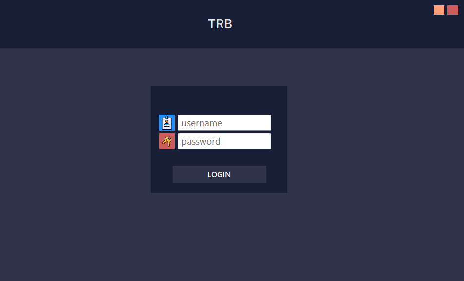
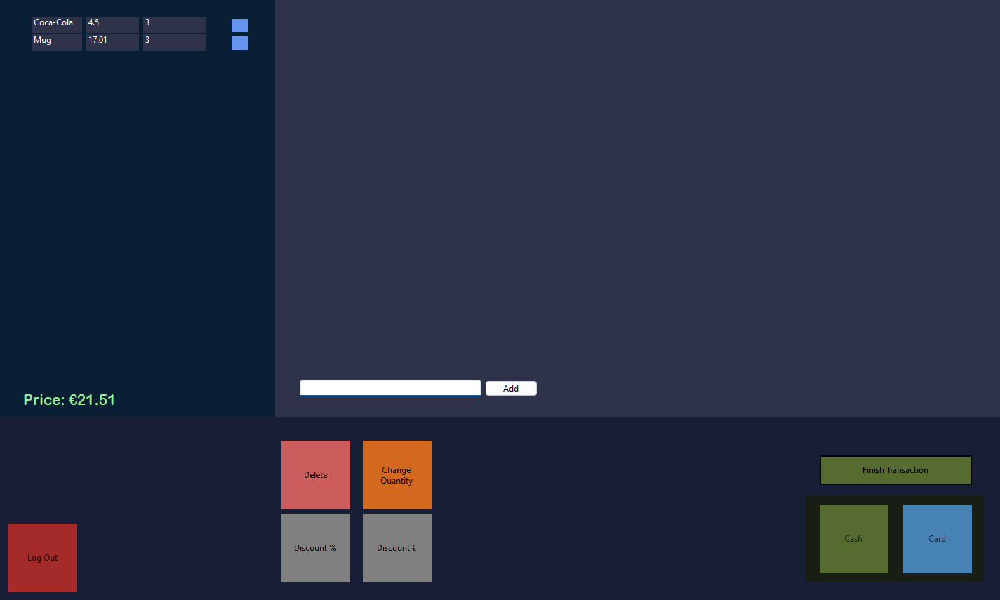
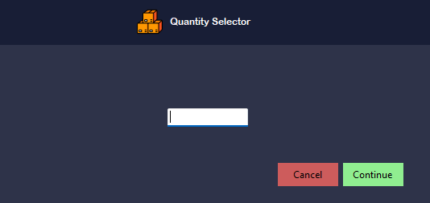

# TRB-POS

A point of sale system developed with Winforms using C#. 

#### Current:
* Login function [needs to be refined]
* Discount functions
* Quantity functions
* Reciept function ready to be integrated
* Product information retrieved from database [SQL]
* Transactions are logged to another databse [SQL]

#### TO DO:
* Inventory management
* Add a searchable DB inside the program
* Test/adapt program for touchscreens
* Optimize and Secure SQL connections 
* Bug testing and cleanup
* Analytics, can be done in a seperate program
* Add features that a normal POS has

## Images

## Attributes
<a href="https://www.flaticon.com/free-icons/goods" title="goods icons">Goods icons created by Smashicons - Flaticon</a>
<a href="https://www.flaticon.com/free-icons/euro" title="euro icons">Euro icons created by Freepik - Flaticon</a>
<a href="https://www.flaticon.com/free-icons/keys" title="keys icons">Keys icons created by nawicon - Flaticon</a>
<a href="https://www.flaticon.com/free-icons/id-card" title="id-card icons">Id-card icons created by nawicon - Flaticon</a>
